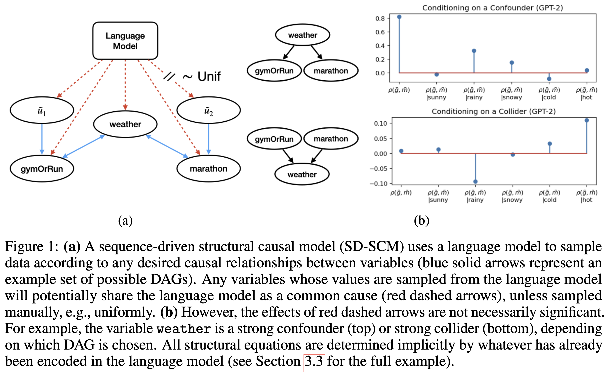
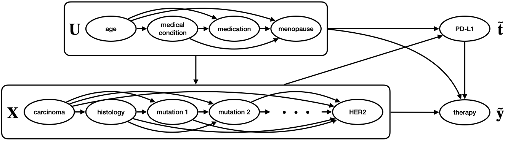

# sequence-driven-scms
Code for "Language Models as Causal Effect Generators" implementing sequence-driven structural causal models (SD-SCMs).

# causal data generation via language model

An SD-SCM allows for interventional and counterfactual data generation with a user-defined DAG and LLM-defined structural equations.

See `confounder_collider.ipynb` for example usage of the functions in `sdscm.py` to generate two SD-SCMs over the same set of variables (one with a confounder, another with a collider).

# benchmark for treatment effect estimation

The `data` folder contains 2000 example datasets for benchmarking treatment effect estimation algorithms (1000 from GPT-2, 1000 from Llama-3-8b) based on the following SD-SCM.

*This SD-SCM family is defined over 14 variables in order to explore the effect of a tumor’s PD-L1 expression levels on different breast cancer therapy plans.*

The file `bcancer_generation.ipynb` demonstrates data generation using the breast cancer SD-SCM family. The notebook `benchmark.ipynb` replicates all effect estimation methods tested in the paper's example benchmark.

# files and usage 
- `confounder_collider.ipynb`: example usage of the functions in `sdscm.py` to generate two simple SD-SCMs
- `bcancer_generation.ipynb`: example generation of a breast cancer SD-SCM using the config file `breast_cancer_config.json`
- `data/cancer_example/`: 2000 example datasets for benchmarking treatment effect estimation algorithms (1000 from GPT-2, 1000 from Llama-3-8b) based on the breast cancer SD-SCM family
- `benchmark.ipynb`: replication of all effect estimation methods tested in the paper's example benchmark
- `bcancer_plots.ipynb`: some plots of the generated breast cancer datasets

Requirements: 
`catenets, econml, matplotlib, networkx, numpy, pandas, plotnine, rpy2, scikit-learn, seaborn, torch, tqdm, transformers`
